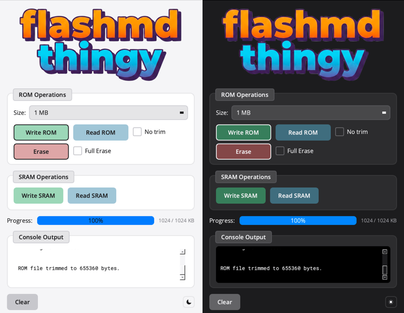

# flashmd-thingy

sega genesis / mega drive rom flasher



## dependencies

- libusb-1.0
- qt5 or qt6

### macos

```
brew install libusb qt
```

### linux

```
sudo apt install libusb-1.0-0-dev qtbase5-dev
```

## build

```
make          # build both cli and gui
make cli      # cli only
make gui      # gui only
```

## usage

the gui makes things easy to use. on linux you need to run with sudo: `sudo ./flashmd-gui`.

### cli

```
sudo ./flashmd [options] <command>
```

#### options

```
-s, --size <KB>    size in kilobytes (for erase, read, write)
-n, --no-trim      don't trim trailing 0xFF bytes (read only)
```

#### commands

```
-r, --read <file>   read rom to file
-w, --write <file>  write rom file to flash
-e, --erase         erase flash
connect             test connection
id                  read flash chip id
clear               clear device buffer
```

#### examples

```
sudo ./flashmd -e                     # full erase
sudo ./flashmd -e -s 1024             # erase 1MB
sudo ./flashmd -w game.bin            # write rom
sudo ./flashmd -r dump.bin -s 0       # read rom (auto-detect size)
sudo ./flashmd -r dump.bin -s 512     # read 512KB
sudo ./flashmd -r dump.bin -s 512 -n  # read exactly 512KB (no trim)
```
